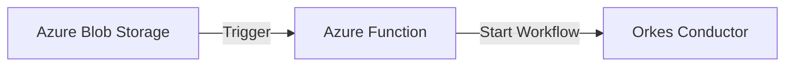

# Azure Function Blob Trigger with Orkes Conductor Integration

This project implements an Azure Function that automatically triggers when a file is uploaded to Azure Blob Storage and initiates an Orkes Conductor workflow with the blob's content.

## Pre-requisites
- Azure Subscription
- Orkes Cloud
- VSCode(Any Code editor)
Note: For Mac,in case you are facing error due to certificates then you can run these commands to install certificates:
```
(security find-certificate -a -p ls /System/Library/Keychains/SystemRootCertificates.keychain && security find-certificate -a -p ls /Library/Keychains/System.keychain) > $HOME/.mac-ca-roots`
export REQUESTS_CA_BUNDLE="$HOME/.mac-ca-roots"
source ~/.bashrc
```

## Architecture Overview



## Components

### 1. Azure Function (`function_app.py`)
- Implements a blob trigger that monitors the `okesblob` container
- Processes uploaded files and extracts:
  - Blob name
  - Blob size
  - Blob content
- Retrieves Orkes configuration from environment variables
- Initiates Orkes workflow with blob data

### 2. Orkes Integration (`orkes_call.py`)
- Handles communication with Orkes Conductor platform
- Key functions:
  - `get_workflow_executor`: Creates authenticated workflow executor
  - `start_workflow`: Initiates workflow with provided input data
- Includes test functionality in `main()`

### 3. Dependencies (`requirements.txt`)
```
azure-functions
requests
conductor-python
```

## Configuration

### Environment Variables Required
- `ORKES_BASE_URL`: Orkes Conductor instance URL
- `ORKES_KEY_ID`: Authentication key ID
- `ORKES_KEY_SECRET`: Authentication key secret
- `WORKFLOW_NAME`: Target workflow name
- `WORKFLOW_VERSION`: Workflow version (default: 1)
- `sbxpubsubpocstorage_STORAGE`: Azure Storage connection string

### Local Development
1. Create `local.settings.json`:
```json
{
  "IsEncrypted": false,
  "Values": {
    "AzureWebJobsStorage": "UseDevelopmentStorage=true",
    "FUNCTIONS_WORKER_RUNTIME": "python",
    "sbxpubsubpocstorage_STORAGE": "<your-storage-connection-string>",
    "ORKES_BASE_URL": "<orkes-url>",
    "ORKES_KEY_ID": "<key-id>",
    "ORKES_KEY_SECRET": "<key-secret>",
    "WORKFLOW_NAME": "<workflow-name>",
    "WORKFLOW_VERSION": "1"
  }
}
```

## Development Setup
1. Create Orkes Application key id and secret 
1. Create Python virtual environment:
```bash
python -m venv .venv
source .venv/bin/activate  # On macOS/Linux
```

2. Install dependencies:
```bash
pip install -r requirements.txt
```

3. Install Azure Functions Core Tools:
```bash
brew tap azure/functions
brew install azure-functions-core-tools@4
```

## Running Locally

1. Start the function:
```bash
func start
```

2. Upload a file to the configured blob container to trigger the function

## Deployment

### Using VS Code
1. Install Azure Functions extension
2. Click on Azure icon
3. Right-click on your function app
4. Select "Deploy to Function App..."

### Using Azure CLI
```bash
func azure functionapp publish YourFunctionAppName
```
